---
## Front matter
title: "Отчёт по лабораторной работе №4"
subtitle: "Архитектура компьютера"
author: "Баптишта Матеуж , НКАбд-01-23"

## Generic otions
lang: ru-RU
toc-title: "Содержание"

## Bibliography
bibliography: bib/cite.bib
csl: pandoc/csl/gost-r-7-0-5-2008-numeric.csl

## Pdf output format
toc: true # Table of contents
toc-depth: 2
lof: true # List of figures
lot: true # List of tables
fontsize: 12pt
linestretch: 1.5
papersize: a4
documentclass: scrreprt
## I18n polyglossia
polyglossia-lang:
  name: russian
  options:
	- spelling=modern
	- babelshorthands=true
polyglossia-otherlangs:
  name: english
## I18n babel
babel-lang: russian
babel-otherlangs: english
## Fonts
mainfont: PT Serif
romanfont: PT Serif
sansfont: PT Sans
monofont: PT Mono
mainfontoptions: Ligatures=TeX
romanfontoptions: Ligatures=TeX
sansfontoptions: Ligatures=TeX,Scale=MatchLowercase
monofontoptions: Scale=MatchLowercase,Scale=0.9
## Biblatex
biblatex: true
biblio-style: "gost-numeric"
biblatexoptions:
  - parentracker=true
  - backend=biber
  - hyperref=auto
  - language=auto
  - autolang=other*
  - citestyle=gost-numeric
## Pandoc-crossref LaTeX customization
figureTitle: "Рис."
tableTitle: "Таблица"
listingTitle: "Листинг"
lofTitle: "Список иллюстраций"
lotTitle: "Список таблиц"
lolTitle: "Листинги"
## Misc options
indent: true
header-includes:
  - \usepackage{indentfirst}
  - \usepackage{float} # keep figures where there are in the text
  - \floatplacement{figure}{H} # keep figures where there are in the text
---

# Цель работы

В пятой лабораторной работе мы рассмотрим, как освоить процедуру компиляции и сборки программ, написанных на ассемблере nasm.

# Выполнение лабораторной работы

**Программа Hello world!**
В этом разделе мы хотели создать программу,которая выводит строку “Hello world!” но на языке ассемблера nasm. Вот почему мы начали с рекурсивного создания нового каталога “~/work/arch-pc/lab05”. (рис. @fig:1)

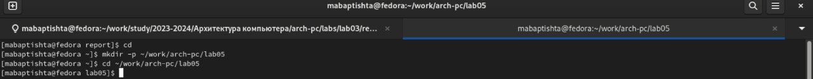{#fig:1}

После этого мы создали текстовый файл в формате .asm, затем открываем только что созданный файл с помощью текстового редактора gedit. (рис. @fig:2)

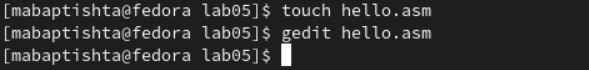{#fig:2}

После этого мы добавили код сборки, который выводит “Hello world!” в файл hello.asm. (рис. @fig:3)

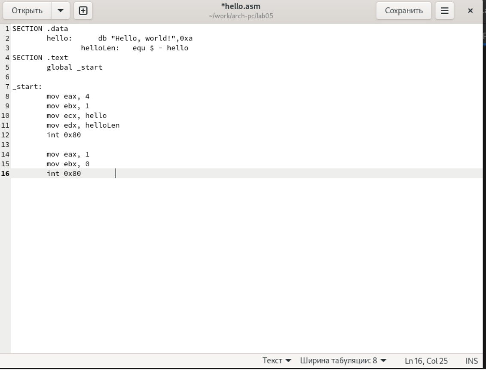{#fig:3}

**Транслятор NASM**

На этом этапе,используя переводчик NASM,мысмогли скомпилировать или перевести код в объектный код, который создал другой файл с форматом .o. (рис. @fig:4)

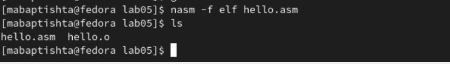{#fig:4}

Используя команду ls, мы проверили работу, проделанную переводчиком, и обнаружили, что объектный файл был создан с тем же именем, что и текстовый файл.

**Расширенный синтаксис командной строки NASM**

Здесь мы запустили полную команду NASM и проверили выходные файлы, которые дала нам.Разница заключалась в том, что с помощью полной команды нам нужно указать имя объектного файла и список файлов, и это то, что получилось после проверки с помощью запятой ls. (рис. @fig:5)

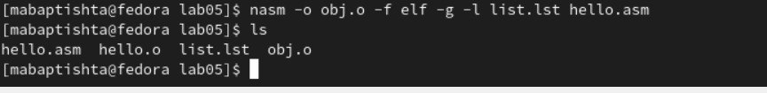{#fig:5}

**Компоновщик LD**

На этом шаге и с помощью компоновщика с командой ld мы смогли получить исполняемый файл, обработав объектный файл. Затем,используя команду ls, мы проверили, что файл был создан. (рис. @fig:6)

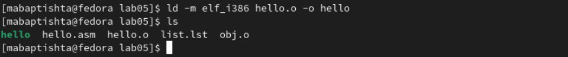{#fig:6}

Затем мы проверили, что можем присвоить исполняемому файлу любое имя,анетолькотожеимя,чтоиобъектномуфайлу,какпоказаноспомощью команды ls. (рис. @fig:7)

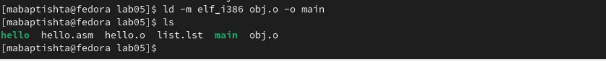{#fig:7}

Исполняемый файл имеет имя “main”, а для объектного файла -“obj”.

**Запуск исполняемого файла**

На этом шаге все, что мы сделали, это запустили исполняемый файл. (рис. @fig:8)

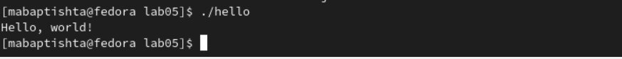{#fig:8}

**Выводы по результатам выполнения заданий**

В этой лабораторной работе мы освоили, как скомпилировать текстовый файл, написанный на языке ассемблера NASM, в объектный файл, получить оправдание,и все это ради создания программы,которая печатает знаменитое предложение “Hello world!”

# Задание для самостоятельной работы

1. В каталоге ~/work/arch-pc/lab05 мы создали копию для файла hello.asm и присвоили ему имя lab05. (рис. @fig:9)

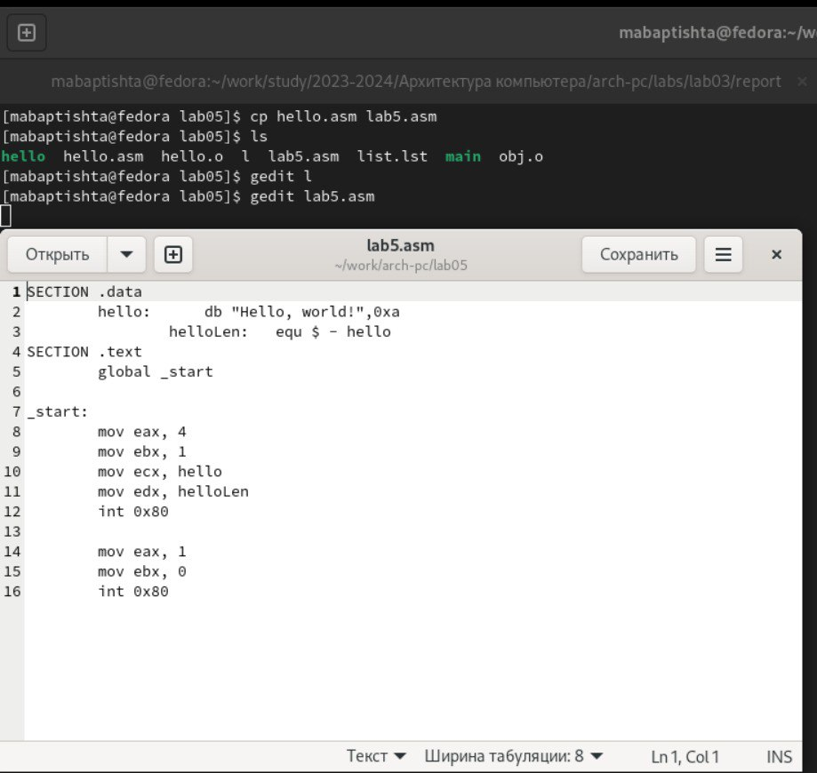{#fig:9}

2. Используя текстовый редактор gedit, мы изменили текстовый файл, содержащий ассемблерный код, чтобы программа выводила мое имя и фамилию “Baptista Mateus”.

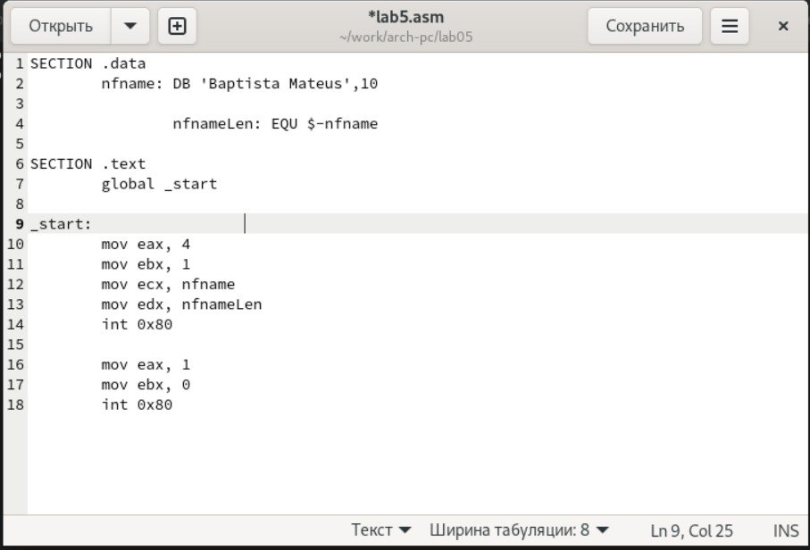{#fig:10}

3.0.1 листинг написанной программы:
SECTION .data
nfname: DB 'Baptista Mateus',10
nfnameLen: EQU $-nfname
SECTION .text
global _start
_start:
mov eax, 4
mov ebx, 1
mov ecx, nfname
mov edx, nfnameLen
int 0x80
mov eax, 1
mov ebx, 0
int 0x80

3. После написания кода e скомпилировал код в объектный файл после чего получил
исполняемый файл с помощью компоновщика. (рис. @fig:11)

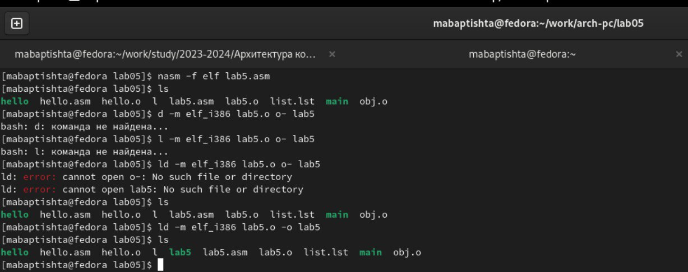{#fig:11}

Затем мы запустили исполняемый файл. (рис. @fig:12)

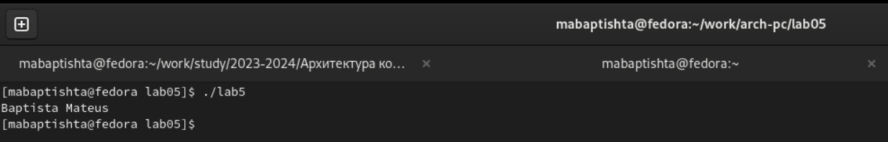{#fig:12}

4. Здесь мы скопировали оба hello.Asm и lab5.asm в ваш локальный репозиторий.
(рис. @fig:13)

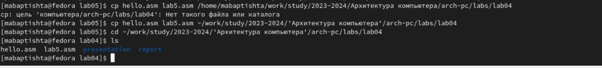{#fig:13}

Наконец, мы загрузили все файлы в удаленный репозиторий. (рис. @fig:14)

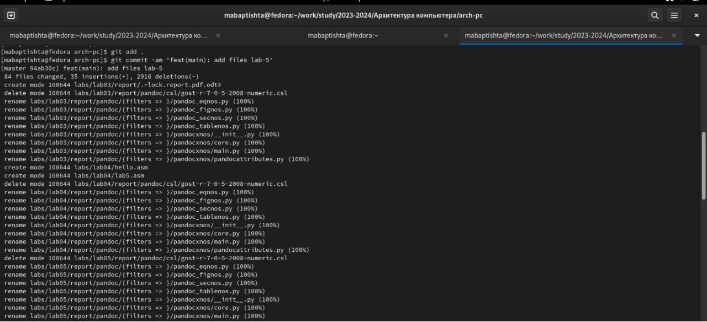{#fig:14}

**Выводы по результатам выполнения заданий**
В этих упражнениях мы применили навыки, полученные в ходе лабораторной работы, в ходе которой получили более глубокое представление об именах регистров и о том, как выделить для них память.

# Выводы

В шестой лабораторной работе мы можем получить практические навыки по созданию компиляции и обработке программы с использованием языка ассемблера Nasm

::: {#refs}
:::
