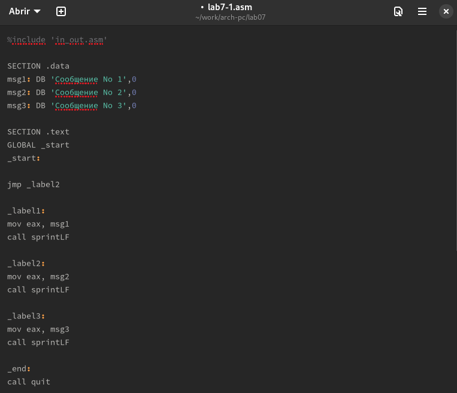

---
## Front matter
title: "Шаблон отчёта по лабораторной работе"
subtitle: "7"
author: "Баптишта Матеуж "

## Generic otions
lang: ru-RU
toc-title: "Содержание"

## Bibliography
bibliography: bib/cite.bib
csl: pandoc/csl/gost-r-7-0-5-2008-numeric.csl

## Pdf output format
toc: true # Table of contents
toc-depth: 2
lof: true # List of figures
lot: true # List of tables
fontsize: 12pt
linestretch: 1.5
papersize: a4
documentclass: scrreprt
## I18n polyglossia
polyglossia-lang:
  name: russian
  options:
	- spelling=modern
	- babelshorthands=true
polyglossia-otherlangs:
  name: english
## I18n babel
babel-lang: russian
babel-otherlangs: english
## Fonts(рис. [-@fig:001])
mainfont: PT Serif
romanfont: PT Serif
sansfont: PT Sans
monofont: PT Mono
mainfontoptions: Ligatures=TeX
romanfontoptions: Ligatures=TeX
sansfontoptions: Ligatures=TeX,Scale=MatchLowercase
monofontoptions: Scale=MatchLowercase,Scale=0.9
## Biblatex
biblatex: true
biblio-style: "gost-numeric"
biblatexoptions:
  - parentracker=true
  - backend=biber
  - hyperref=auto
  - language=auto
  - autolang=other*
  - citestyle=gost-numeric
## Pandoc-crossref LaTeX customization
figureTitle: "Рис."
tableTitle: "Таблица"
listingTitle: "Листинг"
lofTitle: "Список иллюстраций"
lotTitle: "Список таблиц"
lolTitle: "Листинги"
## Misc options
indent: true
header-includes:
  - \usepackage{indentfirst}
  - \usepackage{float} # keep figures where there are in the text
  - \floatplacement{figure}{H} # keep figures where there are in the text
---

# Цель работы
- В восьмой лабораторной работе мы узнаем о команде условных и безусловных
переходов, делая это, мы освоим использование переходов, а также познакомим-
ся со структурой файла листинга.

# Выполнение лабораторной работы :

##Реализация переходов в NASM :

- Здесь мы начали с создания, а затем переместились в восмой каталог лабо-
ратории “~/work/arch-pc/lab07”, после чего мы создали файл “lab7-1.asm”.(рис. [-@fig:1])

{ #fig:1 width=100% }

- После этого мы заполнили файл .asm кодом программы, отображающей
значение регистра eax.(рис. [-@fig:2])

{ #fig:2 width=100% }

- Затем мы скомпилировали файл, создали исполняемый файл и запустили
программу, все это после перемещения файла in_out.asm в тот же каталог,
где находится lab7-1.asm.
(рис. [-@fig:3])

{ #fig:3 width=100% }

- После этого мы изменили код в листинге.(рис. [-@fig:4])

{ #fig:4 width=100% }

- Затем мы снова скомпилировали файл и создали исполняемый файл.(рис. [-@fig:5])

{ #fig:5 width=100% }

- Затем мы снова изменили код в листинге ,чтобы вывод программы был
следующим:
user@dk4n31:~$ ./lab7-1
Сообщение No 3
Сообщение No 2
Сообщение No 1
user@dk4n31:~$
(рис. [-@fig:6])(рис. [-@fig:7])

{ #fig:6 width=100% }
{ #fig:7 width=100% }

-  После этого мы создали файл lab7-2.asm, в который мы добавим код нашей
следующей программы (рис. [-@fig:8])

{ #fig:8 width=100% }

- После этого мы заполнили файл необходимым кодом для Программы, ко-
торая определяет и выводит на экран наибольшую из 3 целочисленных
переменных: A,B и C (рис. [-@fig:9])

{ #fig:9 width=100% }

- мы скомпилировали файл, создали исполняемый файл и запустили его.(рис. [-@fig:10])

{ #fig:10 width=100% }

## Изучение структуры файлы листинга :

- Здесь и с помощью команды nasm -f elf -l lab7-2.list lab7-2.asm мы созда-
ли файл листинга файла lab7-2.asm, затем мы открыли файл с помощью
mcedit.(рис. [-@fig:11])

{ #fig:11 width=100% }

- мы выбрали эти три строки и пытаемся объяснить каждую из них.(рис. [-@fig:12])

{ #fig:12 width=100% }

- Здесь мы переместили значение адреса переменной B в ре-
гистр ecx , после этого мы поместили значение 10 в регистре edx, который
определяет размер переменной B с помощью подпрограммы sread и, нако-
нец, мы вызвали подпрограмму sread

- мы открыли программный файл lab 7-2.asm и удалили один операнд в
любой инструкции с двумя операндами. (рис. [-@fig:13])

{ #fig:13 width=100% }

- В результате изменений был изменен файл листинга , в котором мы по-
лучили ошибку, объясняющую отсутствующий операнд, и файлы не были
созданы.

## Выводы по результатам выполнения заданий :

- Во время лабораторной работы мы узнали, как выполнять условные и без-
условные переходы, как читать файл листинга.

# Задание для самостоятельной работы :

## Написание программы нахождения наименьшей из 3 целочисленных переменных :
                                                     
                                                     
- Мой код : (рис. [-@fig:14])

{ #fig:14 width=100% }

- Вывод кода :(рис. [-@fig:15])

{ #fig:15 width=100% }

## Написание программы

Мой код : (рис. [-@fig:16])

{ #fig:16 width=100% }

Вывод кода :(рис. [-@fig:17])

{ #fig:17 width=100% }

# Выводы по результатам выполнения заданий :

- В этой части мы смогли применить наш полученный навык понятным
способом, заставив программу вычислять конечное значение в зависимости
от значений введенных переменных с использованием условных переходов.

# Выводы, согласованные с целью работы :

- В восьмой лаборатории мы в основном узнали, как использовать условные
и безусловные переходы в NASM, как читать структуру файла листинга.

# Список литературы{.unnumbered}

